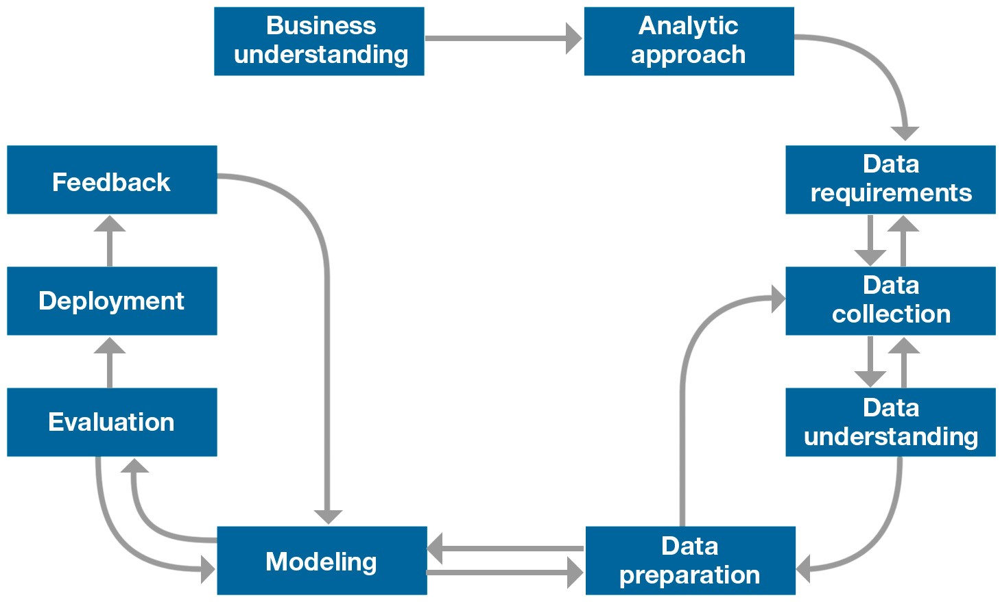

# Pneumonia-Detection  
<blockquote>
  README not complete. I will update soon.
  </blockquote>

## Overview
In this project, <a href='https://github.com/MargaretKagwiria'> Margaret Kagwiria </a> and I apply the Data Science Methodology in classifying
chest X-rays as either Normal or belomging to a Pneumonia patient.  

## Tech Stack  
1. Tensorflow  
2. Keras  
3. Flask  
4. Python 

## Data Science Methodologies  
For this project, we applied the <b>Foundational Methodology</b> for Data Science by John Rollins. However, it is not the only methodology in data science.  
In data mining, the <b>Cross Industry Process for Data Mining (CRISP-DM)</b> methodology is widely used.   
We will first get an overview of CRISP-DM and later on cover the Foundational Methodology with reference to this project.  

### Cross Industry Process for Data Mining (CRISP-DM)  
This process is aimed at increasing the use of data mining over a wide variety of business applications and industries.  
The intent is to take case specific scenarios and general behaviors to make them domain neutral.  
#### Steps

  

1. <b>Business Understanding : </b>Intention of the project is established
2. <b>Data Understanding : </b> Data is collected. This stage relies on the business understanding.  
3. <b>Data Preparation : </b>Data is transformed into a useable subset unless it is determined that more data is needed. The chosen dataset is checked for questionable, missing or ambiguous cases.  
4. <b>Modelling : </b>Models are used to reveal useful insights in the data. Models reveal patterns and structures within the data. Models are trained on a portion of the data and necessary adjustments made.
5. <b>Evaluation : </b>The model is tested on new data not included in the trainig set but part of the dataset.
6. <b>Deployment : </b> The model is used on new data outside the scope of the dataset and by new stakeholders. This stage might reveal new variables and needs for the model and dataset. These could lead to revisions of either business needs and actions, or the model and data, or both.  

### Foundational Methodology  
#### Steps  

  

The methodology aims to answer the following questions.  
#### From problem to approach  
1. <b>What is the problem that you are trying to solve? </b>  
Classify chest x-rays as either Normal of of a patient infected with Pneumonia.  

2.  <b>How can you use data to answer the question? </b>  
Use transfer learning to fine tune Keras MobileNet and VGG16 models to a dataset of chest x-ray images. 

#### Working with the data
3.  <b>What data do you need to answer the question </b>  
Chest x-ray dataset with two categories; Normal and Pneumonia  

4.  <b>Where is the data coming from (identify all sources) and how will you get it? </b>  
Datasets can be found by either manually searching specific sites or by scraping different sources on the web.  
A manual search is okay where datasets are readily available.  
When the data required is not readily available, building a web scraper might be necessary.
We used the manual search and found the following datasets:  
    <ul>  
      <li>
      <a href='https://www.kaggle.com/paultimothymooney/chest-xray-pneumonia '> Chest X-Ray images (Pneumonia) | Paul Mooney </a> We chose this dataset. 
      </li>
      <li>
      <a href='https://www.kaggle.com/pcbreviglieri/pneumonia-xray-images '> Pneumonia X-Ray images | Paulo Breviglleri </a> Adaptation of Paul Mooney's Chest X-Ray.
      </li>    
      <li>
      <a href='https://www.kaggle.com/andrewmvd/pediatric-pneumonia-chest-xray'> Paediatric Pneumonia Chest X-Rays </a> 
      </li>
      <li> 
      <a href='https://www.kaggle.com/prashant268/chest-xray-covid19-pneumonia'> Chest x-rays COVID-19 and Pneumonia  </a> This has 3 categories; COVID-19, Pneumonia and Normal.  
      </li>
      <li>
      <a href='https://www.kaggle.com/jtiptj/chest-xray-pneumoniacovid19tuberculosis'> Chest x-rays COVID-19, Tuberculosis and Pneumonia  </a>  
      </li>
      <li>
      <a href='https://www.kaggle.com/balnyaupane/pneumonia-chest-xray-dataset-200-by-200-image'> Pneumonia_Chest _X-ray_Image_Dataset  </a>
      </li>
    </ul>

5. <b> Is the data collected representative of the problem to be solved?</b>  
Yes. The data has images categorized into NORMAL and PNEUMONIA.  

6. <b> What additional work is required to manipulate and work with the data?</b>  
We redistributed the amount of observations for training and validation purposes to allow for a more balanced machine learning exercise.  
This Dataset has a total of 5856 images - 1583 Normal images, 4273 Pneumonia images.  
The models were trained on two variations of the dataset - Unbalanced and Balanced.    
[Redistribute-images](/Organize_Dataset/organize_data.ipynb) creates the variations.  
We also preprocessed the images as required to pass them to VGG16 and MobileNet models. This preproccessing step can be found here [mobilenet](/MobileNet/mobilenet.ipynb) and [vgg16](/VGG16/VGG16.ipynb)

#### Deriving the answer  
7. <b>In what way can the data be visualized to get to the answer that is required?</b>  

 

